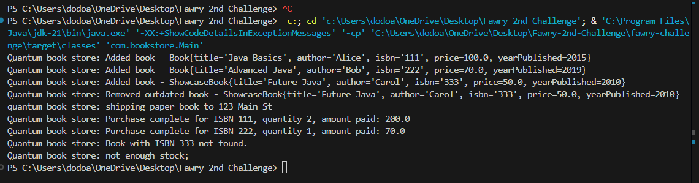

<!DOCTYPE html>
<html lang="en">
<body>

  <h1>📚 BookStore Java Project</h1>

  
This is a simple object-oriented Java project simulating a digital and physical bookstore. It was developed as part of the <strong>Fawry 2nd Challenge</strong> coding competition.

<h2>🖼️ Project Screenshot</h2>

Below is a screenshot of the application running:

  

  <h2>📁 Project Structure</h2>
  <ul class="file-list">
    <li><code>Book.java</code> – Abstract class for all book types</li>
    <li><code>EBook.java</code> – Subclass representing digital books</li>
    <li><code>PaperBook.java</code> – Subclass representing printed books</li>
    <li><code>ShowcaseBook.java</code> – Books displayed in the store</li>
    <li><code>QuantumBookstore.java</code> – Central class for managing bookstore operations</li>
    <li><code>MailService.java</code> – Email service integration (e.g., sending book offers)</li>
    <li><code>Main.java</code> – Entry point to run and test the application</li>
  </ul>

  <h2>🚀 How to Run</h2>
  <ol>
    <li>Clone the repository:
      <pre><code>git clone https://github.com/DuaA-A/Fawry-2nd-Challenge</code></pre>
    </li>
    <li>Open in any Java IDE (e.g., IntelliJ IDEA, VS Code with Java extensions)</li>
    <li>Navigate to <code>Main.java</code></li>
    <li>Run the file to test book interactions and email logic</li>
  </ol>

  <h2>🧠 Features</h2>
  <ul>
    <li>Inheritance structure for book types</li>
    <li>Custom email service (simulated)</li>
    <li>Book display and management via <code>QuantumBookstore</code></li>
    <li>Easy-to-extend architecture</li>
  </ul>

  <h2>🛠️ Technologies</h2>
  <ul>
    <li>Java (OOP Concepts)</li>
    <li>Standard Library (No external dependencies)</li>
  </ul>

  <h2>📌 Notes</h2>
  <ul>
    <li>No database or GUI – focuses on core Java logic</li>
    <li>Useful for understanding OOP, inheritance, and application structure</li>
  </ul>

  <h2>👩‍💻 Author</h2>
  
Developed by <strong>DuaA A.</strong> as part of the Fawry 2nd Challenge.

</body>
</html>
